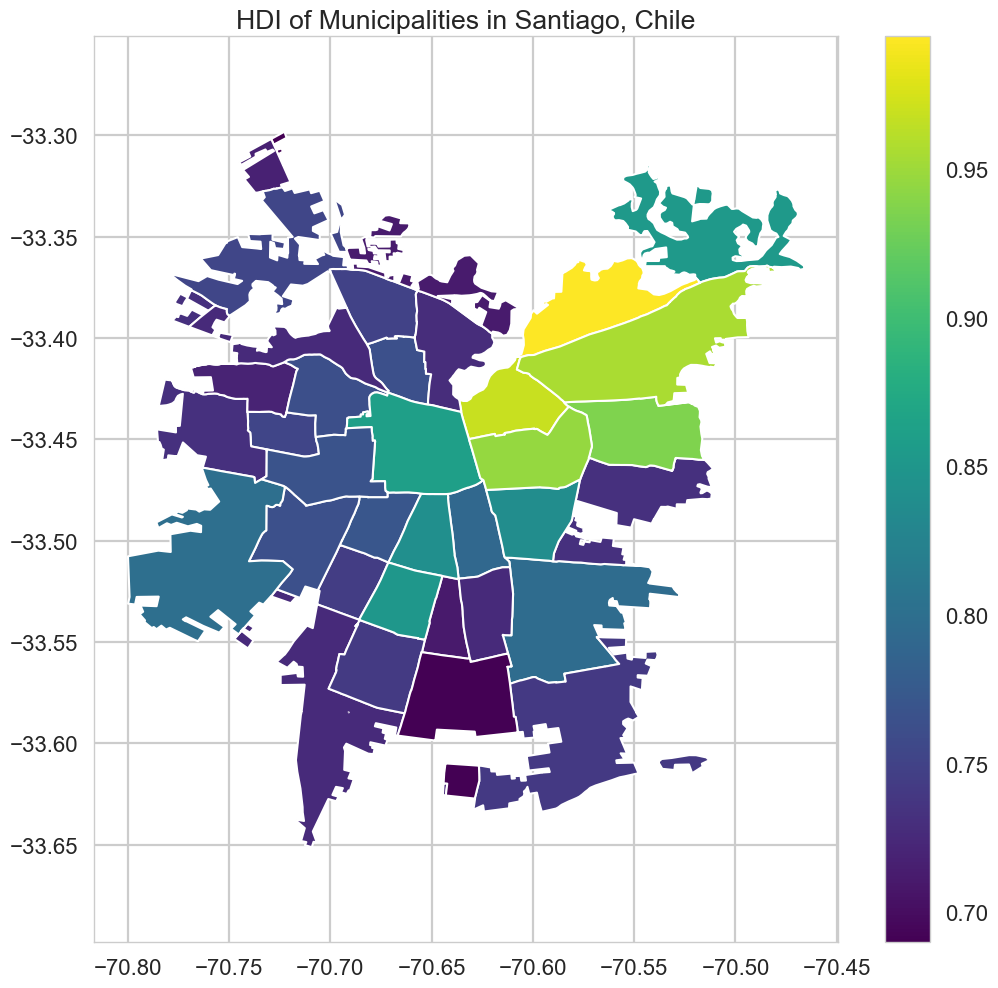

% **WebLoc Through Mobile Phone Datasets**
% **Leo Ferres**\
  UDD & Telefónica R+D, Chile\
  `lferres@udd.cl`\
  FB, IG, Tw, GH: leoferres
% LocWeb Workshop, WWW'19\
	San Francisco, May 13, 2019\
	\tiny s2019-01-19 09:47:32 -0300 - e:2019-04-23 11:23:33 -0400\normalsize

# Introduction

# Prelims: Geo

All this work has been done in Santiago de Chile.

{
width=93% }

# Prelims: Geo & Towers

{ width=70% }\ {height=50%}

# Prelims: Geo & Partitioning Space

- Political (admin) and ``artificial'' grids over SCL

{width=50%}\ { width=50% }

\scriptsize Comuna, census districts, census zones, and blocks;
square, hexagonal, Voronoi and Vo1k (on towers) grids\normalsize

# Prelims: Telephony

- CDR (**C**all **D**etail **R**ecord) a tuple $\langle n_a, n_b, t_a,
  t_b, d, r\rangle$ (used mainly for billing minutes, sparse in time,
  coarse in space)

- XDR (e**X**tended **D**etail **R**ecord) a tuple $\langle n_a, t_a,
  d, k\rangle$ (used mainly for billing data usage, dense(r) in time,
  coarse in space)

- !(DPI (**D**eep **P**acket **I**nspection, or User Control Plane) a
  tuple $\langle n_a, t_a, d, k, p\rangle$ (used for data bandwidth
  allocation))

- !(CP (**C**ontrol **P**lane), used for network ``health''
  monitoring, not persisted, network events like handovers, shakes,
  etc.)

\scriptsize where $n$ is a phone number (hashed), $t$ is the lat/lon of a tower,
$d$ is a timestamp, $r$ is duration, $k$ is bytes downloaded and $p$
is the ``protocol'' (the app's code... hand-labeled (!)) \normalsize

# Mobility as a Gendered Problem

**Research question:**. \textcolor[rgb]{0.0,0.0,1.0}{do we observe
   similar mobility patterns across gender in association to the
   presence/lack of public transport?}

- **Definition**: An individual $i$ "moves more" than an
   individual $j$ iff $S^{i} > S^{j}$, where $S$ is Shannon's entropy
   $S=-\sum\limits_{l\in L}p_l\ln p_l$, over each individual's $i,j$
   set of all visited places $L$.

- **Definition**: A "place" $l\in L$ is a 1Km2 cell in a square
grid\footnote{If you'd like to know why I hate Voronois, catch me
after the talk and change my mind.}  where there is at least one cell
tower.

# Mobility as a Gendered Problem: Datasets

CDR:

- Period:
	- June-August, 2016 (3 months)
	- 2,148,132,995 rows (CDRs, calls), 1.06TB

- Pre-processing, for each (unique) $n$ (in origin and destination):
	- $u = 1$,
	- $g$ and $e$ are not `null`,
	- `events(`$n$`)` > 91, and finally
	- `home(`$n$`)` is not `null`
	- $c$ is "contract"

for a total of **372,152** individuals, **50.9\%** female.

GTFS:

 - access to public transport
 - number of reachable stations
 - average velocity to reach other nodes in the network

# Mobility as a Gendered Problem: Map of GTFS access

{
height=260px }

# Mobility as a Gendered Problem: Entropy Results

{height=250px}

# Meanwhile, in the third most sold Chilean newspaper...

{ height=260px }\

# Mobility as a Gendered Problem: A gender inequality index

{ height=260px }\

# Mobility as a Gendered Problem: Effect of access to public transport

{ height=150 }\

{ height=150 }\

# XDR

Two studies, in order of appearance:

- Eduardo Graells-Garrido, Leo Ferres, Diego Caro and Loreto
  Bravo. **The effect of Pokémon Go on the pulse of the city: a natural
  experiment**. EPJ Data Science (2017) 6:23.

	 - **Research question:**. \textcolor[rgb]{0.0,0.0,1.0}{?}

- Mariano Beiró, Loreto Bravo, Diego Caro, Ciro Cattuto, Leo Ferres
and Eduardo Graells-Garrido. **Shopping mall attraction and social
mixing at a city scale**. EPJ Data Science (2018) 7:28.

	 - **Research question:**. \textcolor[rgb]{0.0,0.0,1.0}{Can
       malls be socially inclusive hotspots?}

# PoGo: XDR datasets

# Malls: XDR datasets

XDR:

- Period:
  - August 2016 XDRs
  - 1M mobile phones

- Pre-processing:
  - 16 malls in Santiago
  - 481 indoors towers
  - 70% of users connected 80% of the month (25 days)
  - Home-located 50%

for a total of **387,000** individuals and **1.4M** mall visits

Human-Development Index (HDI, per comuna)

- Education
- Health and life expectancy
- Income

# Malls: SCL HDI

{ width=70% }

# Malls: SCL HDI visits

{ width=%110 }

# Malls: A Mall's Area of Influence

{ width=50% }\ { width=50% }

``Atajarrotos'' effect...

# DPI

- Apps, Twitter?, News

# Limitations

# Policy implications

# Privacy considerations

It's a common question:

- Numbers are hashed,
- towers are aggregated at the 1Km2 level,
- no reporting of towers with < 3 different (hashed) numbers,
- data do not leave TEF servers (except at very high levels of
  aggregation),
- We **do not** report on (or care about, really) individuals (only
  aggregations).

BUT...

# Privacy considerations

The **\textcolor[rgb]{1.0,0.0,0.0}{uncommon}** question is the
following:

- what are the social costs of **not** doing these studies?

# Thank you!
