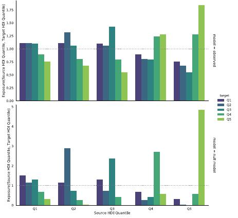

% **Calls, Indoor Towers, DPIs, and More People in Parks at Night**
% **Leo Ferres**\
  UDD & Telefónica R+D, Chile\
  `lferres@udd.cl`\
  FB, IG, Tw, GH: @leoferres
% LocWeb Workshop, WWW'19\
	San Francisco, May 13, 2019\
	\texttt{https://github.com/leoferres/locweb19}\
	\tiny s2019-01-19 09:47:32 -0300 - e:2019-05-13 13:31:33 -0400\normalsize

# Introduction

\note{

- More than 52% of web traffic generated by mobile phones (2018)
- No rough IPs anymore... geoloc at the level of tower
- Data (and people) are difficult to work with
- Treasure trove of potential results
- Cheaper, real-time, large-scale surveys
- Potentially high social impact
}
Given

- $>$ 52% of web traffic generated by mobile phones (2018),
- high penetration of cellphones (1.3/person in Chile),
- computational power for analysis of vldb,
- no rough IPs anymore... geoloc at the level of tower,
- real-time, large-scale, fine-grained datasets

resulted in

- renewed interest in ``individual'' human mobility behavior,
- using ?(locweb) to tackle important social issues, e.g.
  - gender
  - segregation and poverty
  - use of public spaces
  - information consumption

# Prelims: Geo

- Santiago de Chile, founded in 1541, ~7M people, ~840Km2

{
width=93% }

# Prelims: Geo & Towers

{ width=70% }\ {height=50%}

\note{# Prelims: Geo & Partitioning Space

- Political (admin) and ``artificial'' grids over SCL

{width=50%}\ { width=50% }

\scriptsize Comuna, census districts, census zones, and blocks;
square, hexagonal, Voronoi and Vo1k (on towers) grids\normalsize
}

# Prelims: Telephony

- **CDR** (**C**all **D**etail **R**ecord) a tuple $\langle n_a, n_b, t_a,
  t_b, d, r\rangle$ (used mainly for billing minutes, sparse in time,
  coarse in space)

- **XDR** (e**X**tended **D**etail **R**ecord) a tuple $\langle n_a, t_a,
  d, k\rangle$ (used mainly for billing data usage, dense(r) in time,
  coarse in space)

- !(**DPI** (**D**eep **P**acket **I**nspection, or User Control Plane) a
  tuple $\langle n_a, t_a, d, k, p\rangle$ (used for data bandwidth
  allocation))

- ?(**CP** (**C**ontrol **P**lane), used for network ``health''
  monitoring, not persisted, network events like handovers, shakes,
  etc.)

\scriptsize where $n$ is a phone number (hashed), $t$ is the lat/lon of a tower,
$d$ is a timestamp, $r$ is duration, $k$ is bytes downloaded and $p$
is the ``protocol'' (the app's code... hand-labeled (!)) \normalsize

# CDR: Mobility & Gender

**Research question:**\footnote{Study funded by
\textcolor[rgb]{0.0,0.0,1.0}{Data2x} at the United Nations: ISI
Foundation, GovLab, UNICEF, NYU, Digital Globe and us
(IDS/UDD/TEF).}. \textcolor[rgb]{0.0,0.0,1.0}{do we observe similar
mobility patterns across gender in association to the presence/lack of
public transport?}

- **Definition**: An individual $i$ "moves more" than an individual
   $j$ iff $S^{i} > S^{j}$, where $S$ is Shannon's entropy over each
   individual's $i$ set of all visited places $L$:

   $$S=-\sum\limits_{l\in L}p_l\ln p_l$$

- **Definition**: A "place" $l\in L$ is a 1Km2 cell in a square grid
where there is at least one cell tower.

# CDR: Mobility & Gender: Datasets

CDR:

- Period:
	- June-August, 2016 (3 months)
	- 2,148,132,995 rows (CDRs, calls), 1.06TB

- Pre-processing, for each (unique) $n$ (in origin and destination):
	- $u = 1$,
	- $g$ and $e$ are not `null`,
	- `events(`$n$`)` > 91, and finally
	- `home(`$n$`)` is not `null`
	- $c$ is "contract"

for a total of **372,152** individuals, **50.9\%** female.

GTFS:

 - access to public transport
 - number of reachable stations
 - average velocity to reach other nodes in the network

# CDR: Mobility & Gender: Map of GTFS access

{
height=260px }

# CDR: Mobility & Gender: Entropy Results

{height=250px}

# Meanwhile, in the third most sold Chilean newspaper...

{ height=260px }\

# CDR: Mobility & Gendered: A gender inequality index

{ height=260px }\

# CDR: Mobility & Gender: Access to public transport

{ height=150 }\

{ height=150 }\

# CDR: Mobility & Gender: Conclusions

 - Mobility is (strongly) gendered,
 - there are gender differences in mobility patterns when it comes to
   lack of public transportation,
 - we need a smarter way to think about mobility, particularly when it
   comes to gender, and

BUT...

 - Should policies be implemented?
	- small, incremental,
	- A/B testing when possible,
	- involve social scientists and policy makers early on.

In any case,

 - without data equality, there's no gender equality

# XDR

Two studies, in order of appearance:

- Eduardo Graells-Garrido, Leo Ferres, Diego Caro and Loreto
  Bravo. **The effect of Pokémon Go on the pulse of the city: a natural
  experiment**. EPJ Data Science (2017) 6:23.

	 - **Research question:**. \textcolor[rgb]{0.0,0.0,1.0}{Was the
	 city more crowded after the launch of Pokémon Go?}

- Mariano Beiró, Loreto Bravo, Diego Caro, Ciro Cattuto, Leo Ferres
and Eduardo Graells-Garrido. **Shopping mall attraction and social
mixing at a city scale**. EPJ Data Science (2018) 7:28.

	 - **Research question:**. \textcolor[rgb]{0.0,0.0,1.0}{Given
	 their prominence in the city, and the segregation of Santiago, do
	 Shopping Malls function as social mixers?}

# XDR: PoGo: datasets

XDR:

- Period:
  - Jul 27-Aug 2, 2016; Aug 4-7, 2016
  - 1M mobile phones

- Pre-processing:
  - only phones in the OD travel survey
  - spatially "active" (not static, POS)
  - 2.5MiB < download < 500MiB/day
  - flag for "contract" vs. pay as you go

for a total of **142,988** devices active all days.

Together with two other datasets:

- Origin-Destination Survey
- Ingress Pokestops (Pokemon POIs)

# XDR: PoGo: Connections

 - The pulse of the city (floating population profiles) one week before
and after the launch of Pokémon Go in Santiago (3rd August).

# XDR: PoGo: The Model

Regression (negative binomial)

$$E[X_t] = \exp[\lg a+\beta_0+\beta_1W+\beta_2X+\beta_3Y+\beta_4Z]$$

where

- a is the surface area,
- $W$ is the PoGo availability (binary, before/after),
- $X$ is the daily pattern (business days, weekends, etc.)
- $Y$ is land use, (residential, business, and areas with mixed
  activities\footnote{Graells-Garrido, E.; Peredo, O.; García,
  J. Sensing Urban Patterns with Antenna Mappings: The Case of
  Santiago, Chile. Sensors 2016, 16, 1098.}
- $Z$ number of Pokepoints

# XDR: PoGo: Results (Incidence Rate Ratio)

{ width=55% } \ { width=45% }

# XDR: PoGo: Results (geoloc'ed)

# XDR: PoGo: Conclusions

- The first natural experiment with replicable methods using XDR

- People mostly played the game at commuting times (13%), which are
  likely to be one of the most stressful moments of the day.

- We observed that even on residential areas, which are unlikely to
  have people at night on the streets, had a significant increase in
  the number of people (10%).

  - More people out (at night, in parks) make it safer for other
	people

# XDR: Malls

XDR:

- Period:
  - August 2016 XDRs
  - 1M mobile phones

- Pre-processing:
  - 16 malls in Santiago
  - 481 indoors towers
  - 70% of users connected 80% of the month (25 days)
  - Home-located 50%

for a total of **387,000** individuals and **1.4M** mall visits

Human-Development Index (HDI, per comuna)

- Education
- Health and life expectancy
- Income

# XDR: Malls: SCL HDI

{width=70% }\ {width=35%}

2013-2015 reconstructed HDI (last HDI in 2005; r=0.89, p=.0000)

#  Spatial segregation

Loufs et al.'s definition of segregration\footnote{Louf R, Barthelemy
M (2016) Patterns of residential segregation. PLoS ONE 11(6):0157476,
Link: \texttt{\url{https://bit.ly/2Jbzthw}}}
$$E_{\alpha\beta}=\frac{1}{N_\alpha}\sum\limits_{m\in
M}n_\alpha(m)r_\beta(m)$$

where
$$r_\beta(m)=\frac{n_\beta(m)/N_{\beta}(m)}{n(m)/N}$$

So, intuitively, if $E_{\alpha\beta}>1$, then mixing happens; else,
segregation.

# XDR: Malls: HDI Segregation

{
width=75% }

# Take out and a question

- **So: there's more than distance that drives mall visits: is
 diversity also a factor?**

# XDR: Malls: A Mall's Area of Influence

{ width=50% }\ { width=50% }

``Atajarrotos'' effect... but is it really only about distance? A job
for some Gravity Model! (Isard, 1954)\footnote{I know you knew, but
makes me look thorough}

# XDR: Malls: Gravity model of visits

Testing the factors that influence mall visits using Gravity Model:
$$F_{ij} = G\frac{M^\alpha_i M_{j}^{\beta}}{D_{ij}^{\gamma/S_j}}$$
where:

 - $F_{ij}$ is number of visitors from comuna $i$ to mall $j$
 - $M_i$ is the population of comuna $i$
 - $M_j$ is the size of mall $j$
 - $D_{ij}$ is the distance between comuna $i$ and mall $j$, and in
 particular
 - **$S_j$ is the diversity of mall $j$**, so malls with higher
entropy appear as closer: $$S_j=-\sum\limits_{q\in Q} p_q\lg p_q$$
where $p_q$ is the fraction of visitors to mall $j$ that belong to HDI
percentile $q$.

# XDR: Malls: Fitting

{ width=60% }

\scriptsize NB regression: most significant is distance $t(D_{ij})=54.8, p<.001$, $t(D_{ij}/S_j)=57.8, p<.001$), all coefficients were positive, implying a negative effect of distance but a positive effect of mall social diversity on mall election.
\normalsize

# XDR: Malls: Conclusions

 - After fitting the model, it is possible to predict the social
   characteristics of mall visitors,

 - $D$istance is the most important factor when choosing malls,

 - Mixing is (statistically) larger than we'd find if visitors were to
   visit the nearest mall. Thus,

 - A positive effect of social mixing in choosing what mall to visit
   (at equal $D$ and $M$, people prefer diverse malls).

# DPI: The Urban Life of Mobile Applications

- Graells-Garrido, E., Caro, D., Miranda, O., Schifanella, R., &
  Peredo, O. F. (2018, April). **The WWW (and an H) of Mobile
  Application Usage in the City: The What, Where, When, and How**. In
  Companion of the The Web Conference 2018 on The Web Conference 2018
  (pp. 1221-1229). (YES! Presented at LocWeb last year! )

  - **Research questions**: \textcolor[rgb]{0.0,0.0,1.0}{How is mobile
  application usage shaped by the urban context? How is the urban
  context shaped by mobile application usage?}

# DPI: Urban: Datasets

DPI:

- Labeled app requests,
- XDR (floating population estimation)

Auxiliary:

- OpenStreetMap (urban infrastructure, POIs),
- Results from the Mode of Transportation inference paper (labeled
  towers with mode of transportation)

# DPI: Urban: Hotspots

# DPI: Urban: Daily Routine

{ width=70% }

- some apps constant usag/ day (video, social media), others related
  to commuting (music, news, transportation)

# DPI: Urban: POIs

Correlation between app usage request rate (y axis) and the
availability of points of interest (x axis) according to OSM
{ width=80% }

- Pick your fave! (blue if negative, red if positive, black is
  nuttin')

# DPI: Urban: Conclusions

- App usage is related with the urban context! When people looks at
  their phones, the activities they do and the places they are in,
  outside of the screen, are also relevant

# DPI: News: Intro

Some hot off the lab results using DPI:

- S Vilella, L Ferres, D Paolotti, G Ruffo (in
  preparation). **Inspecting urban inequalities in information-seeking
  behaviour**.

A more granular study than

- E Elejalde, L Ferres, R Schifanella. (Accepted). **Understanding News
  Outlets' Audience-Targeting Patterns**. EPJ Data Science (Springer)

**GOAL**: studying geo-located accesses to news media websites from
areas of different socio-demographic features:
\textcolor[rgb]{0.0,0.0,1.0}{Does reading grow linearly with HDI?}

# DPI: News: Dataset

DPI:

- July 2016
-  IP addresses of 27 news media outlets, for most of which we know
   their political alignment\footnote{Elejalde, E., Ferres, L.,
   Herder, E.: On the nature of real and perceived bias in the
   mainstream media. PloS one 13(3), 0193765 (2018)} and ownership
   structure\footnote{Bahamonde, J., Bollen, J., Elejalde, E., Ferres,
   L., Poblete, B.: Power structure in chilean news media. PloSone
   13(6), 0197150 (2018)}
- A month of DPI:
\begin{table}[h]
	\scriptsize
	\begin{tabular}{lllllr}
		&antenna&date&hour&ip&usrs\\
		1&00000000 & 20160706 &11 & 200.12.26.117&1\\
		2&00000000&20160706&14&190.153.242.131&1\\
		3&00000000&20160706&14&200.12.20.11&1\\
		4&00000000&20160706&15&190.110.123.219&1\\
		... &... &... &... &... & ...
	\end{tabular}
\end{table}

Secondary:

- The 2017 abridged census
- !(The 2017 presidential election results (by district))

# DPI: News: Clustering census districts

- Autocorrelation using age, schooling (years), student status
  (yes|no), % native
- K-means of the socio-demographic division of SCL

{ width=60% }\ {width=40% }

# DPI: News: General results
{ width=75% }

- Connections at weekends (reduce effects offloating population).
- highly educated are the most eager consumer of news media content
  (especially the youngest group, C2)

# DPI: News: Individual results I
{ width=95% }

- Group C2 always remains on top of the others, but...!

# DPI: News: Individual results II
{ width=95% }

- Group ABC1 displays similar behaviour to groups C3-D-E,
- except for Diario Financiero or El Mercurio editorial group

# DPI: News: Conclusions

- The lowest segments of census are - in proportion - those who
  consume news media content the least

- The simplistic assumption that the interest to news media grows
  “linearly” with the level of education is proven wrong

# General conclusion

- Unprecedented possibility to do real-time, large-scale and spatially
  granular (location-based) science with high potential for social impact.

# Limitations

- Datasets are not well understood (what tower do you connect to?)
- Lack of ground truth
- Sample bias: company, admin areas, etc.
- poor access and poor availability for reproducibility

# Policy implications

- Government still reluctant
- Ministry of Transportation eager to develop new policies (gender)
- INE thinks we're the devil
- Uber willing to look into new price models
- UN and policy

# Future work

- How to fight (unknown) biases?
- How to generalize these models to other cities?
- How to compare different cities?
- How to validate results in the absence of ground truth data?
- How to expand collaborations with domain experts and encourage
  adoption of these methods?
- How to ensure privacy in a systemic and verifiable way?
- How to involve policy makers?

# Privacy considerations

It's a common question:

- Numbers are hashed,

- towers are aggregated at the 1Km2 level,

- no reporting of towers with < 3 different (hashed) numbers,

- data do not leave TEF servers (except at very high levels of
  aggregation),

- We **do not** report on (or care about, really) individuals (only
  aggregations).

BUT...

# Privacy considerations

The **\textcolor[rgb]{1.0,0.0,0.0}{uncommon}** question is the
following:

- what are the social costs of **not** doing these studies?

# Thank you!

## Collaborators

\scriptsize
Loreto Bravo (IDS, UDD & Telefonica), Eduardo Graells
(IDS, UDD & Telefonica), Diego Caro (IDS, UDD & Telefonica), Daniela
Opitz (IDS, UDD & Telefonica), Fran Varela (IDS, UDD & Telefonica),
Pablo García (BCI), Eric Ancelovici (Telefónica), Manuel Sacasa
(Telefónica), Andrés Leiva (Telefónica), Ciro Cattuto (ISI
Foundation), Daniela Paolotti (ISI Foundation), Laetitia Gauvin (ISI
Foundation), Michele Tizzoni (ISI Foundation), Johan Bollen (Indiana
University), Rossano Schifanella (U Torino), Giancarlo Ruffo (U
Torino), Erick Elejalde (L3S, Germany), Markus Strohmeier (Aachen,
Germany), Eelco Herder (Radboud, The Netherlands), Bruno Goncalves (JP
Morgan, USA), Stefaan Verhulst (NYU, USA), Natalia Adler (UNICEF,
USA), Ricardo Baeza-Yates (Northeastern@Silicon Valley), Salvatore
Vilella (ISI, UTorino), Meng He (Dalhousie, Canada), Travis Gagie
(Dalhousie, Canada), Norbert Zhe (Dalhousie, Canada), Mariano Beiró
(UBA, Argentina), André Panisson (ISI Foundation), Michel Dumontier
(Maastricht, The Netherlands), Karim Touma (Falabella)
\normalsize
